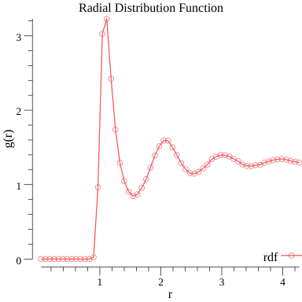

# moldyn

This is a simple molecular dynamics package built in go. The motivation behind this package was to learn golang and make use of it's ability for minimal fuss parallelisation. The idea is that where possible we will use channels to allow concurrent processing allowing for a ~30% speedup without needing to deal with MPI. This will enable the package to take advantage of modern multicore machines.

\
\
\
\

  

  

### TODO:
* [x] energy analysis 
* [x] radial distribution function
* [x] plotting functions
* [x] langevin (first order)
* [ ] cell lists: https://wwwee.ee.bgu.ac.il/~specmeth/EMT04/pdf/session_2/2_14_04.pdf 
* [ ] structure factor
* [ ] chemical potential (via widom insertion) 
* [ ] cavity function (via henderson's method)
* [ ] make it easy to add new forces
